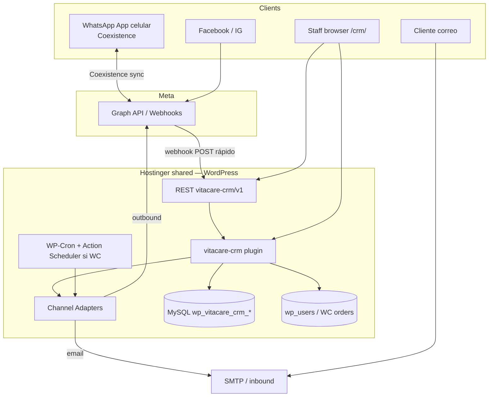
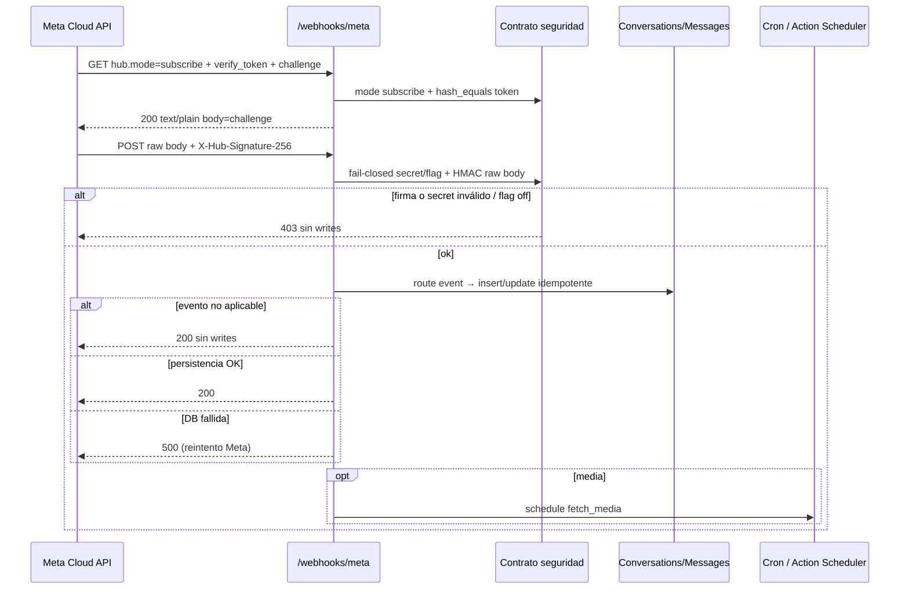
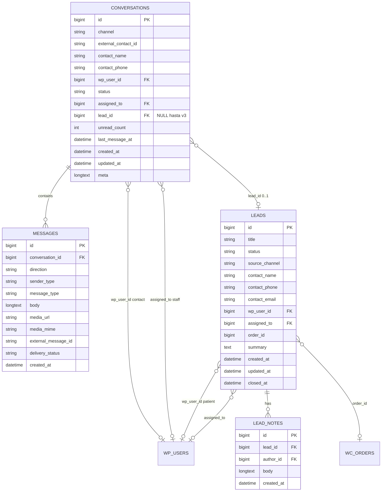
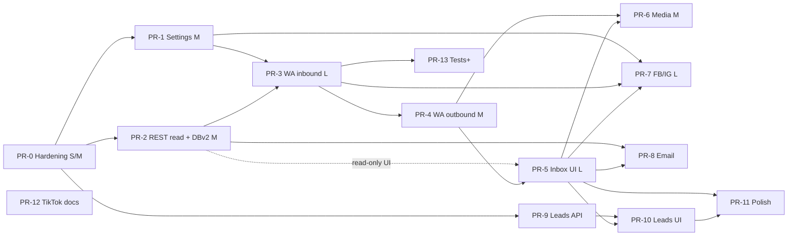

# VITACARE Ecuador CRM — Diseño completo del producto

| Campo | Valor |
|---|---|
| **Título** | VITACARE CRM — Diseño de producto e ingeniería |
| **Autor** | _Pendiente de asignación_ (equipo ingeniería / Yusiel) |
| **Fecha** | 2026-08-03 |
| **Última revisión** | 2026-08-03 (post design review) |
| **Estado** | Draft (revisado) — **fuente de verdad en GitHub** |
| **Repo** | https://github.com/yusieluh/crmvitacare |
| **Plugin** | `vitacare-crm` v0.1.0 (Fase 1 en código) |
| **URL CRM (producción)** | https://vitacareec.org/crm |
| **Integración** | Plugin en WP del dominio; **no modifica** el sistema existente; solo **lectura** de datos |
| **Documentación** | Cada tarea actualiza `ESTADO_CRM.md` + push a GitHub (`docs/PROCESS.md`) |
| **MVP shippable** | PR-0 … PR-6 (WhatsApp + bandeja + media) |

---

## Para dirección / VITACARE (no técnico)

> Esta sección es la capa ejecutiva. El resto del documento es ingeniería de implementación.

### Qué se construye

Un **panel interno** en el sitio web de VITACARE (`/crm/`) donde el personal ve y responde conversaciones de WhatsApp (y más adelante Facebook, Instagram y correo), con un **pipeline de leads** (nuevo → contactado → seguimiento → convertido / perdido) y vínculo opcional al paciente o pedido ya existente en WordPress/WooCommerce.

### Qué no se construye (por ahora)

- No se contrata ni monta Chatwoot, erxes u otro CRM en un servidor aparte.
- No se “hackea” WhatsApp con programas no oficiales (riesgo de bloqueo del número).
- No se toca el plugin/tema principal del sitio (`vitacare-core` / `vitacare-theme`).
- TikTok queda solo en investigación (fase tardía).

### Celular y WhatsApp

Con **Cloud API + Coexistence (Meta 2025)** el **WhatsApp Business del celular sigue funcionando**. Los mensajes del teléfono y del panel web se sincronizan. El staff no pierde la app del móvil.

### Costo Meta (importante)

Desde el **1 de octubre de 2026** Meta cobra por mensajes de **servicio** enviados vía Cloud API. El CRM contará mensajes salientes/mes para que VITACARE pueda presupuestar. En el MVP solo se responden conversaciones **dentro de la ventana de 24 horas** del cliente (sin plantillas masivas proactivas).

### Quién puede entrar

- Día 1 (default): solo **administradores** de WordPress.
- Si hay recepcionistas/supervisores no-admin que deban usar el panel **antes** de la fase de pulido, se les otorga el permiso de CRM **sin** acceso a contraseñas de Meta (ver KD-8 / OQ2).

### Preguntas que bloquean o retrasan (respuesta de Yusiel / VITACARE)

| # | Pregunta | Bloquea | Default si no hay respuesta a tiempo |
|---|---|---|---|
| OQ1 | ¿Hay staging en Hostinger o se prueba en prod con Meta en modo desarrollo? | Go-live orden | Meta **modo desarrollo** + backup; ventana corta en prod |
| OQ3 | Email: ¿SMTP ya configurado? ¿Inbound parse vs IMAP? | PR-8 | MVP **sin email entrante**; solo saliente `wp_mail` cuando se implemente email |
| OQ5 | ¿Plantillas WhatsApp fuera de 24h en v1? | PR-4 UX | **No** en MVP; solo respuesta en ventana; templates → Fase 6 |
| OQ9 | ¿App Meta ya creada? | PR-3 prueba real | Ingeniería prepara código; go-live WA espera app |
| OQ2 | ¿Staff no-admin día 1? | Caps en MVP | Solo admin (KD-8) hasta que se pida lo contrario |

Otras preguntas (retención, HPOS, notificaciones, cupo mensual Meta) tienen **defaults de producto** en Key Decisions y no bloquean el MVP.

### Glosario breve

| Término | Significado |
|---|---|
| **Bandeja / inbox** | Lista de conversaciones + hilo de mensajes |
| **Lead** | Oportunidad comercial con estados de pipeline |
| **Coexistence** | WhatsApp en celular **y** en CRM a la vez (oficial Meta) |
| **Webhook** | Aviso automático de Meta al sitio cuando llega un mensaje |
| **Capability** | Permiso de WordPress (`vitacare_crm_access`) |
| **MVP** | Primera versión usable en producción: WhatsApp + bandeja |

---

## Overview

VITACARE Ecuador necesita una **bandeja unificada de conversaciones** (WhatsApp, Facebook Messenger, Instagram Direct, correo) y un **pipeline de leads** acoplado al WordPress/WooCommerce ya en producción, sin montar un CRM externo (Chatwoot, erxes) ni VPS/Docker adicional.

La solución es el plugin independiente **`vitacare-crm`**, instalado en el mismo Hostinger shared hosting que el sitio principal. Reutiliza header/footer del tema activo vía `template_include`, crea tablas propias `wp_vitacare_crm_*`, capability `vitacare_crm_access`, y expone REST bajo `vitacare-crm/v1`. **No modifica** `vitacare-core` ni `vitacare-theme`.

La **Fase 1** (esqueleto) ya existe en el repo: tablas conversations/messages, página `/crm/`, stub REST `/ping`, UI de métricas placeholder. Este documento define el producto completo (fases 1→7), remedia hallazgos de auditoría de Fase 1, y descompone la implementación en PRs ordenados y revisables.

**MVP shippable = PR-0 … PR-6:** hardening + settings + WhatsApp (inbound/outbound/status/media) + UI bandeja. Leads, FB/IG, email y polish son post-MVP.

---

## Background & Motivation

### Contexto de negocio

VITACARE ofrece servicios y formaciones/certificaciones de salud. El contacto con prospectos y pacientes ocurre hoy principalmente por **WhatsApp Business en el celular**, más redes Meta y correo. No hay bandeja multiagente ni historial centralizado ligado a usuarios WP / pedidos WooCommerce.

### Estado actual (sitio + plugin)

| Capa | Estado |
|---|---|
| WordPress + WooCommerce | Producción en Hostinger shared (`web.vitacareec.org`) |
| `vitacare-core` / `vitacare-theme` | Sistema principal (fuera de este repo; no se toca). CSS del tema (`--wine`, `--teal`, etc.) **no verificable** en este clone — se asumen variables del tema en prod; el CRM aporta fallbacks |
| `vitacare-crm` Fase 1 | Esqueleto local/GitHub: activación, tablas, `/crm/`, REST ping |
| Canales reales | Ninguno conectado aún |
| Leads/pipeline | No existe |
| HPOS / SMTP / App Meta | **No verificables** en este clone — Open Questions / defaults |

### Decisiones de arquitectura ya cerradas (no reabrir sin razón fuerte)

- Plugin propio en el mismo hosting compartido (sin VPS/Docker para Chatwoot/erxes).
- Descartados: `trycompai/crm`, erxes, Chatwoot.
- WhatsApp: **solo** Meta Cloud API + **Coexistence** (2025). Prohibido Baileys / whatsapp-web.js.
- Tablas base: `wp_vitacare_crm_conversations`, `wp_vitacare_crm_messages`.
- Capability: `vitacare_crm_access` (admin nativo por ahora).
- Independencia total de core/theme; reuso visual vía `template_include`.

### Pain points que el CRM resuelve

1. Historial de conversaciones fragmentado en el teléfono de una persona.
2. Sin asignación ni handoff entre staff.
3. Sin vínculo formal lead → paciente WP / pedido WooCommerce.
4. Riesgo regulatorio y de bloqueo si se usaran clientes no oficiales de WhatsApp.
5. Costo de infraestructura extra de un CRM SaaS/self-hosted separado.

### Hallazgos de auditoría Fase 1

Verificados línea por línea contra el clone (2026-08-03). Tras **PR-0**, marcar 1–5 y 8–10 como ✅ en `ESTADO_CRM.md`. El hallazgo 7 (settings) se cierra en **PR-1** (Fase 1S), no en PR-0.

| # | Hallazgo | Severidad | Dónde se remedia |
|---|---|---|---|
| 1 | Cap check solo en shell UI; anónimos ven header/footer + “sin permiso” | Media | **PR-0** `template_redirect` login + cap |
| 2 | REST `/ping` público (`__return_true`) | Baja (OK health) | Documentar en PR-0; write routes con auth/firma |
| 3 | Sin path de migración más allá de option `vitacare_crm_db_version` | Media | **PR-0** `Vitacare_Crm_Upgrader::maybe_upgrade()` |
| 4 | Sin login gate en `/crm/` | Alta | **PR-0** |
| 5 | CSS casi vacío; depende 100% del tema | Media | **PR-0** fallbacks |
| 6 | Sin tablas leads/pipeline | — | **PR-9** (post-MVP) |
| 7 | Sin settings de credenciales Meta | Alta (bloquea WA) | **PR-1** (Fase 1S), **no** PR-0 |
| 8 | `uninstall.php` conserva datos | OK | Documentar hard-delete en PR-0 |
| 9 | `Requires at least: 7.0.2` erróneo para WP | Baja | **PR-0** → `6.4` |
| 10 | Sin tests, zip, `.gitignore` | Media | **PR-0** tooling + skeleton tests |

**Residual gaps no verificables en clone (no son bugs del diseño):** comportamiento real de `vitacare-core`/tema, HPOS en prod, SMTP, App Meta. Docs Meta Coexistence son fuente de verdad al implementar (payload fields pueden variar por versión Graph).

---

## Goals & Non-Goals

### Goals

1. Bandeja unificada multi-canal con lista de conversaciones, hilo y compositor de respuesta.
2. WhatsApp Cloud API + Coexistence: webhook verify, inbound, outbound desde CRM, **outbound desde app móvil**, `message_status`, media básica.
3. Facebook Messenger + Instagram Direct reutilizando el mismo patrón de adapter (post-MVP).
4. Canal email (post-MVP; default provisional: outbound only hasta decidir inbound).
5. Pipeline de leads (post-MVP): estados, asignación, notas, link a `wp_user_id` / pedido WC.
6. Seguridad adecuada a datos de pacientes (PII): auth, caps, HMAC webhooks, nonces, deny-direct media/logs.
7. Operable en **Hostinger shared hosting** (sin workers largos, webhooks rápidos, cron real obligatorio en go-live WA).
8. Instalación por ZIP del plugin en producción tras staging/backup.
9. **Todas las strings de UI de producto y admin del CRM en español en v1.**

### Non-Goals

- No reescribir ni forkar vitacare-core / vitacare-theme.
- No CRM de marketing automation completo (email sequences, scoring ML, etc.).
- No app móvil nativa (mobile web usable en Fase 6).
- No integración TikTok en el camino crítico (solo investigación Fase 7).
- No multi-tenant / multi-sitio.
- No sustituir WooCommerce ni el flujo de citas/pedidos existentes.
- No sincronización bidireccional completa de Meta Ads.
- **No Application Passwords** ni API machine-to-machine en v1 (solo cookie + `X-WP-Nonce` para staff en browser).
- **No plantillas HSM / mensajes proactivos fuera de ventana 24h en MVP.**

### Supuestos de carga (año 1)

| Métrica | Supuesto de diseño | Si se supera |
|---|---|---|
| Staff concurrente en `/crm/` | &lt; 10 | Revisar polling interval y queries |
| Conversaciones / año | &lt; 5 000 | Revisar archivo/archivo frío; índices OK |
| Mensajes / año | &lt; 50 000 | Particionar listados; no full scans |
| Mensajes salientes / mes (costo Meta) | Definir cupo soft en settings (default alerta a 1 000; ajustable) | Política de uso + templates controlados en Fase 6 |
| Tamaño media unitaria | ≤ 16 MB (límite práctico shared; alinear a caps Meta por tipo) | Rechazar upload |

El diseño **se revisa** si se superan estos umbrales de forma sostenida. Post-oct 2026 el cuello de botella de negocio esperado es **costo Meta**, no MySQL.

---

## Product vision & roles de usuario

### Visión de producto

> Un único lugar interno (`/crm/`) donde el staff de VITACARE ve y responde conversaciones de todos los canales, convierte contactos en leads con pipeline visible, y conecta cada hilo con el paciente o pedido real en WordPress — sin abandonar la app de WhatsApp Business del celular (Coexistence).

### Roles

| Rol | Capability / mecanismo | Permisos CRM |
|---|---|---|
| **Administrator** (WP nativo) | `vitacare_crm_access` + `manage_options` para settings | Todo: bandeja, leads, settings Meta/email, asignación |
| **Staff / Supervisor** (futuro, o adelantado si OQ2) | Solo `vitacare_crm_access` (sin `manage_options`) | Bandeja, responder, leads, notas; **sin** secretos Meta |
| **Agente** (futuro Fase 6+) | Cap opcional `vitacare_crm_agent` | Solo conversaciones asignadas |
| **Anónimo / paciente** | Ninguna | Redirect a login |

**Default (KD-8):** solo `administrator` con `vitacare_crm_access` hasta Fase 6 **salvo** que OQ2 pida staff no-admin en MVP: entonces grant de cap a roles indicados **sin** abrir settings (settings siempre `manage_options`).

### Personas y flujos primarios

1. **Recepcionista / staff:** abre `/crm/`, filtra WhatsApp abiertas, responde, (post-MVP) mueve lead.
2. **Supervisor:** reasigna, cierra, vincula a `wp_user` si el paciente ya existe (matching **manual**).
3. **Admin técnico:** configura tokens Meta, verifica webhook, monitorea ping y runbooks.

---

## UX: bandeja (inbox) y pipeline de leads

### Principios UX

- Densidad de escritorio primero; mobile usable en Fase 6.
- Español en toda la UI de producto y admin CRM.
- Heredar identidad VITACARE (clases tema + **fallbacks CRM**).
- Tres zonas en bandeja: lista | hilo | contexto (contacto / lead).

### Wireframe lógico — Bandeja `/crm/` (MVP PR-5)

```
┌──────────────────────────────────────────────────────────────────────────┐
│  CRM VITACARE          [Bandeja] [Leads*]    Usuario · Cerrar sesión    │
├────────────┬─────────────────────────────┬───────────────────────────────┤
│ Filtros    │  Hilo: María Pérez · WA     │  Contacto                     │
│ ○ Todas    │  ─────────────────────────  │  Tel: +593…                   │
│ ● Abiertas │  [ella] Hola, quiero info   │  Canal: WhatsApp              │
│ ○ Cerradas │  [yo/CRM] ¡Claro! …         │  Asignado: —                  │
│            │  [yo/app] Te paso el link   │  WP user: vincular… (manual)  │
│ Canales    │  …                          │  Lead: (post-MVP)             │
│ [WA]…      │  ─────────────────────────  │                               │
│ Lista      │  [________ mensaje ______]  │                               │
│ ▸ María 2m │  [Adjuntar] [Enviar]        │                               │
└────────────┴─────────────────────────────┴───────────────────────────────┘
* Tab Leads visible post-MVP (PR-10); en MVP puede ocultarse o mostrar “Próximamente”.
```

### Relación conversación ↔ lead (normativa — una sola)

**Modelo único elegido:**

- Cada **conversación** tiene **0..1 lead activo**: columna `conversations.lead_id` NULL.
- Cada **lead** puede aparecer en **0..n conversaciones**: `SELECT * FROM conversations WHERE lead_id = %d`.
- **No existe** tabla puente `conversation_lead` ni relación N:M.
- Si en el futuro se necesita historial (lead cerrado + nuevo lead en el mismo hilo): se actualiza `conversations.lead_id` al lead nuevo; el lead anterior permanece en `leads` con su `status` (`perdido`/`convertido`) y deja de estar referenciado por esa conversación. Historial de vínculo no es requisito del MVP ni de Fase 5 v1.

### Interacciones clave (bandeja)

| Acción | Comportamiento |
|---|---|
| Cargar lista | `GET /conversations` (ver contratos API) |
| Abrir hilo | `GET /conversations/{id}/messages?before_id=&limit=` |
| Enviar | `POST /conversations/{id}/messages` |
| Cerrar / asignar | `PATCH /conversations/{id}` (allowlist) |
| Polling | JS cada 20s en conversación abierta (rango 15–30s) |
| Fuera de ventana 24h | Compositor deshabilitado o error claro; **no** envío de template en MVP |

### UX — Pipeline de leads (post-MVP, PR-10)

- Kanban por estado + tabla.
- Estados: `nuevo` | `contactado` | `seguimiento` | `convertido` | `perdido`.
- Desde contexto de conversación: “Crear lead” / “Ver lead” (setea `conversations.lead_id`).

---

## Proposed Design

### Arquitectura de alto nivel



### Patrón Channel Adapter

```php
interface Vitacare_Crm_Channel_Adapter {
	/** @return string whatsapp|facebook|instagram|email */
	public function channel(): string;

	public function verify_webhook( WP_REST_Request $req ): WP_REST_Response|WP_Error;

	/** Persistencia inbound; debe ser rápido; sin side-effects si firma ya validada en dispatch. */
	public function handle_inbound( array $normalized_event ): true|WP_Error;

	/**
	 * @param array{body?:string,media_path?:string,media_type?:string} $payload
	 */
	public function send_outbound( int $conversation_id, array $payload ): array|WP_Error;

	public function fetch_media( string $media_id ): string|WP_Error;
}
```

| Clase | Canal | Fase / PR |
|---|---|---|
| `Vitacare_Crm_Channel_WhatsApp` | `whatsapp` | MVP PR-3…PR-6 |
| `Vitacare_Crm_Channel_Facebook` | `facebook` | PR-7 |
| `Vitacare_Crm_Channel_Instagram` | `instagram` | PR-7 |
| `Vitacare_Crm_Channel_Email` | `email` | PR-8 (post decisión OQ3) |

### Graph API version pin

- Constant / setting: `VITACARE_CRM_GRAPH_VERSION` default **`v21.0`** (o la versión estable documentada al implementar).
- Usar en todas las URLs Graph: `https://graph.facebook.com/{version}/...`
- **Revisión anual** obligatoria anotada en `ESTADO_CRM.md` (Meta depreca ~2 años). No hardcodear la versión en más de un lugar.

### Flujo webhook WhatsApp (secuencia)



### Contrato de seguridad webhook (normativo)

Esta subsección es **obligatoria** como DoD de PR-3. Implementación sin estos puntos = no merge.

#### Auth model de rutas

| Ruta | `permission_callback` | Auth real |
|---|---|---|
| `GET/POST /webhooks/meta` | `__return_true` | **Dentro del callback**: verify_token (GET) o HMAC (POST) |
| Rutas staff | `require_crm_access` | Cookie session + `X-WP-Nonce` |
| `/ping` | `__return_true` | Ninguna (health; sin PII) |

**No** proteger webhooks con cookie/nonce: Meta no las envía. Un dev no debe “arreglar” esto poniendo `is_user_logged_in` en `permission_callback`.

#### Registro de rutas vs feature flags

- Las rutas `/webhooks/meta` se **registran siempre** (URL estable para Meta aunque el flag cambie).
- Si `vitacare_crm_feature_whatsapp` está **off** **o** falta App Secret / verify token: handler hace **short-circuit fail-closed** → **403** (POST) o **403/404** (GET) **sin writes**.
- Cambiar el flag **no** requiere flush de rewrite rules.

#### Fail-closed y matriz de respuestas

| Condición | HTTP | Writes DB | Notas |
|---|---|---|---|
| App Secret vacío / no configurado | 403 | No | Fail closed |
| Feature flag whatsapp off | 403 | No | Ruta existe |
| `X-Hub-Signature-256` ausente o HMAC inválido | 403 | No | `hash_equals` timing-safe |
| GET: `hub.mode !== 'subscribe'` | 400/403 | No | |
| GET: verify token no coincide | 403 | No | `hash_equals( $expected, $provided )` |
| GET: mode+token OK | 200 | No | Body = **challenge** crudo; `Content-Type: text/plain` |
| POST: evento no soportado / ignorado | **200** | No | Evita storm de reintentos Meta |
| POST: persistencia OK (o idempotent hit) | 200 | Sí / no-op | |
| POST: error infraestructura DB | **500** | No (o partial log) | Meta reintenta |

**Seguridad fail-closed** (firma inválida → 403, sin writes). **Errores de infraestructura** → 5xx para reintento de Meta. **Eventos no aplicables** → 200 sin writes.  
*(No usar la frase “fail open” para webhooks — confunde con “dejar pasar requests”.)*

#### Cuerpo crudo (raw body) para HMAC

1. Firmar **exactamente** el raw body bytes que Meta envió.
2. Preferir lectura temprana: capturar `file_get_contents( 'php://input' )` en un hook lo antes posible **o** `$request->get_body()` de WP_REST_Request **sin** re-serializar el array parseado.
3. **Advertencia Hostinger/WP:** otros plugins pueden consumir `php://input` (solo legible una vez). Si el body llega vacío, fallar **403/400** (fail closed), no validar sobre JSON re-encodeado.
4. Header: `X-Hub-Signature-256: sha256=<hex>`.
5. Comparación:

```php
$expected = 'sha256=' . hash_hmac( 'sha256', $raw_body, $app_secret );
if ( ! hash_equals( $expected, $signature_header ) ) {
	return new WP_REST_Response( null, 403 );
}
```

#### Verify GET

```php
// Exigir:
// hub.mode === 'subscribe'
// hash_equals( $stored_verify_token, $hub_verify_token )
// return challenge as plain text 200
```

#### Idempotencia y carreras

- Columna `external_message_id` VARCHAR(191) NULL.
- **Estrategia go-live (normativa):**
  1. Antes de insert: `SELECT id FROM messages WHERE external_message_id = %s LIMIT 1` → si existe, no-op 200.
  2. Insert; si hay condición de carrera, preferir **UNIQUE KEY** en `external_message_id` **solo para valores no vacíos**.
  3. En MySQL, múltiples NULL no violan UNIQUE: para outbound sin id aún, usar id temporal `local:{uuid}` y luego update al wamid de Graph, **o** insertar solo tras respuesta Graph con wamid.
  4. Para inbound Meta siempre hay wamid → exigir non-empty `external_message_id` en mensajes inbound/webhook.
  5. Opcional refuerzo: `GET_LOCK( 'vitacare_crm_wa_' . md5(contact_id), 3 )` alrededor del upsert de conversación+mensaje si se observan duplicados en prod.

#### URL de registro Meta (checklist Hostinger)

1. Ajustes WP → Enlaces permanentes: **no** “Simple” (pretty permalinks ON).
2. URL canónica webhook: `https://web.vitacareec.org/wp-json/vitacare-crm/v1/webhooks/meta`
3. Fallback si pretty falla: `https://web.vitacareec.org/?rest_route=/vitacare-crm/v1/webhooks/meta`
4. Probar desde fuera: `curl -i "URL?hub.mode=subscribe&hub.verify_token=TOKEN&hub.challenge=123"` → body `123`, 200.
5. HTTPS válido; sin auth HTTP básica en esa ruta.

#### Protección de logs y media en disco

Directorios bajo `wp-content/uploads/vitacare-crm/`:

- `logs/` y media: crear en runtime con:
  - `index.php` vacío (silence)
  - `.htaccess` Apache: `Require all denied` (o `Deny from all` en Apache 2.2)
  - Nota Nginx/Hostinger: si el vhost ignora `.htaccess` en uploads, **serve solo vía REST** y nombres opacos de alta entropía; documentar en runbook si Hostinger usa Nginx front.
- Logger **nunca** escribe access tokens ni cuerpos completos de mensajes en nivel `info`.
- Nivel `debug` off en producción por defecto; si se enciende, aviso admin en settings (“riesgo PII”).

### Coexistence — mapeo de eventos webhook (normativo PR-3 / PR-4)

Fuente de verdad de campos: **docs Meta Cloud API vigentes** al implementar (nombres exactos pueden variar por versión). Lógica de producto:

| Evento webhook (concepto) | Señal típica | Acción DB | `direction` | `sender_type` |
|---|---|---|---|---|
| Mensaje del contacto | `messages[]` con `from` = wa_id cliente; type text/image/… | Upsert conversation; insert message si wamid nuevo | `inbound` | `contact` |
| Mensaje enviado por **negocio desde app móvil** (Coexistence echo) | `messages[]` con origen business / campo que Meta documente para mensajes salientes sincronizados (p.ej. contexto `smbid` / messages en historial business) — **validar contra docs al codear** | Insert si wamid nuevo | `outbound` | `staff` (origen app; `meta.origin=app` en JSON opcional) |
| Mensaje enviado por **CRM vía Cloud API** | Respuesta Graph trae `messages[0].id` (wamid); además puede llegar webhook echo | Insert al enviar con ese wamid **o** update fila `local:…` → wamid; webhook echo → **dedupe por `external_message_id`** | `outbound` | `staff` |
| Estado delivered/read/failed | `statuses[]` con `id` = wamid, `status` | **Update** `messages.delivery_status` donde `external_message_id` = id; si no hay fila, log debug y **200** (no crear mensaje fantasma) | — | — |
| Tipo desconocido | — | Log; **200** sin write | — | — |

**Reglas:**

1. **Dedupe universal** por `external_message_id` (= wamid) para inbound y outbound (app y CRM).
2. Outbound CRM: persistir **antes o justo después** de Graph con el wamid devuelto; si el webhook llega antes (raro), el insert del webhook gana y el send path hace no-op al ver wamid existente.
3. UI hilo: mostrar badge sutil “desde app” vs “desde CRM” si `meta.origin` disponible; no bloquear MVP si Meta no distingue de forma fiable — en ese caso ambos son `outbound`/`staff`.
4. **`message_status` ownership:** implementación en **PR-3** (handler statuses básico) completada/endurecida en **PR-4** junto a outbound CRM (misma columna `delivery_status` de DB v2).

### Pseudo-código `meta_webhook_dispatch` (POST)

```php
function meta_webhook_dispatch( WP_REST_Request $req ) {
	$raw = $req->get_body(); // raw; no re-json_encode
	$secret = Vitacare_Crm_Settings::get_secret( 'app_secret' );
	if ( $secret === '' || ! Vitacare_Crm_Settings::flag( 'whatsapp' ) /* y otros meta flags */ ) {
		return new WP_REST_Response( null, 403 );
	}
	$sig = $req->get_header( 'x-hub-signature-256' );
	if ( ! Vitacare_Crm_Meta::valid_signature( $raw, $sig, $secret ) ) {
		return new WP_REST_Response( null, 403 );
	}
	$payload = json_decode( $raw, true );
	if ( ! is_array( $payload ) ) {
		return new WP_REST_Response( null, 400 );
	}
	// Routing multi-canal (PR-3 WA; PR-7 amplía):
	// object === 'whatsapp_business_account' → WhatsApp adapter
	// object === 'page' → Facebook / Instagram según entry.messaging / ig
	try {
		foreach ( entries as entry ) {
			foreach ( changes / messaging as event ) {
				$adapter->handle_inbound( normalize( event ) ); // idempotent
			}
		}
	} catch ( PersistenceException $e ) {
		Vitacare_Crm_Logger::error( ... );
		return new WP_REST_Response( null, 500 );
	}
	return new WP_REST_Response( array( 'ok' => true ), 200 );
}
```

### Estructura de archivos objetivo

```
vitacare-crm/
├── vitacare-crm.php
├── uninstall.php
├── .gitignore
├── includes/
│   ├── class-vitacare-crm-activator.php
│   ├── class-vitacare-crm-upgrader.php
│   ├── class-vitacare-crm-page.php
│   ├── class-vitacare-crm-rest.php
│   ├── class-vitacare-crm-settings.php      # PR-1
│   ├── class-vitacare-crm-crypto.php
│   ├── class-vitacare-crm-conversations.php
│   ├── class-vitacare-crm-messages.php
│   ├── class-vitacare-crm-leads.php         # PR-9
│   ├── class-vitacare-crm-notes.php
│   ├── class-vitacare-crm-logger.php
│   ├── class-vitacare-crm-meta.php         # HMAC helpers
│   └── channels/
│       ├── interface-channel-adapter.php
│       ├── class-vitacare-crm-channels.php
│       ├── class-channel-whatsapp.php
│       ├── class-channel-facebook.php
│       ├── class-channel-instagram.php
│       └── class-channel-email.php
├── template-parts/
│   ├── crm-page.php
│   ├── crm-shell.php
│   ├── crm-inbox.php
│   └── crm-leads.php
├── assets/css/crm.css
├── assets/js/crm.js, crm-inbox.js, crm-leads.js
├── bin/package-plugin.ps1
└── tests/                                  # skeleton PR-0; HMAC/perm PR-3
```

### Hardening de acceso a `/crm/` (PR-0 / Fase 1H)

En `Vitacare_Crm_Page::init()`:

1. **`template_redirect`** (temprano):
   - Si `is_page( VITACARE_CRM_PAGE_SLUG )` y `! is_user_logged_in()` → `auth_redirect()` / login con redirect back.
   - Si logueado y `! current_user_can( VITACARE_CRM_CAPABILITY )` → plantilla denied **sin** queries a tablas CRM (sin conteos).
2. Check en shell como defensa en profundidad (mismo criterio: sin SQL si no hay cap).
3. **`ensure_caps()`** en `plugins_loaded` / upgrader: re-aplica `vitacare_crm_access` al rol administrator (y roles configurados). Cubre deploy ZIP **sin** re-activar el plugin.
4. **noindex:** `X-Robots-Tag: noindex, nofollow` en `/crm/` + `wp_robots` / `noindex` en head. Excluir página de sitemaps si el SEO plugin expone filtro.
5. **Enqueue:** solo si es página CRM **y** usuario logueado (defensa en profundidad; tras redirect anónimos no deberían llegar). No localizar `restNonce` vacío a anónimos.
6. No exponer la página en menús públicos del tema por defecto (ops: no añadir “CRM” al menú primario del sitio).

### Jobs en background: WP-Cron vs Action Scheduler

| Mecanismo | Uso |
|---|---|
| **Action Scheduler** (si WooCommerce activo lo provee) | **Preferido** para `fetch_media`, reintentos Graph con backoff |
| **WP-Cron** nativo | Fallback si AS no está; mismos hooks |
| **Cron HTTP real Hostinger** | **Requisito go-live WA:** hit a `wp-cron.php` cada 5–15 min (no depender solo de tráfico web) |

---

## Domain model

### Diagrama ER (sin tabla puente)



### Tabla canónica de migraciones (una sola DB version dueña por cambio)

`VITACARE_CRM_DB_VERSION` se almacena como string numérica (`'1'`, `'2'`, …); el upgrader compara con `(int)` cast. **Prohibido** anotar columnas como “v2/v3”.

| DB ver | Dueño PR | Cambios exactos |
|---|---|---|
| **1** | Fase 1 (actual) | CREATE `conversations`, `messages` como en `class-vitacare-crm-activator.php` actual |
| **2** | **PR-2** | **conversations:** ADD `unread_count` INT UNSIGNED NOT NULL DEFAULT 0; ADD `updated_at` DATETIME NULL; ADD `meta` LONGTEXT NULL; ADD KEY `assigned_to` (`assigned_to`); ADD KEY `last_message_at` (`last_message_at`); ADD **UNIQUE** `channel_contact_unique` (`channel`, `external_contact_id`); ADD KEY `status_last_msg` (`status`, `last_message_at`). **messages:** ADD `media_mime` VARCHAR(100) NULL; ADD `delivery_status` VARCHAR(20) NULL; ADD `message_type` VARCHAR(20) NOT NULL DEFAULT `'text'`; ADD UNIQUE `external_message_id_unique` (`external_message_id`) — ver nota NULL abajo |
| **3** | **PR-9** | CREATE `leads`, `lead_notes`; **conversations:** ADD `lead_id` BIGINT UNSIGNED NULL; ADD KEY `lead_id` (`lead_id`). **Sin** tabla `conversation_lead` |

**Nota UNIQUE `external_message_id`:** en MySQL, UNIQUE permite múltiples NULL. Política: inbound/webhook **siempre** persisten wamid non-null; filas locales temporales usan `local:{uuid}` non-null hasta recibir wamid (UPDATE in place). Así el UNIQUE es efectivo.

**UNIQUE `(channel, external_contact_id)`:** **decidido para go-live desde v2** — evita hilos duplicados split-brain en Fase 2. Un contacto = una conversación por canal. (Reabrir solo si producto exige hilos paralelos por el mismo wa_id.)

**Backfill v2:** filas existentes: `unread_count` default 0; `updated_at` NULL o `created_at`; `delivery_status` NULL; no requiere script aparte si defaults/NULL bastan. `dbDelta` + `upgrade_to_2()` idempotente.

### Tablas — detalle columnas

#### `wp_vitacare_crm_conversations`

| Columna | Desde | Notas |
|---|---|---|
| `id` | v1 | PK |
| `channel` | v1 | `whatsapp\|facebook\|instagram\|email` |
| `external_contact_id` | v1 | WA wa_id; FB/IG PSID/IGSID; email address |
| `contact_name` | v1 | |
| `contact_phone` | v1 | E.164 preferido |
| `wp_user_id` | v1 | Paciente WP; matching **manual** (KD-16) |
| `status` | v1 | `open\|pending\|closed` |
| `assigned_to` | v1 | Staff WP; índice desde **v2** |
| `last_message_at` | v1 | índice desde **v2** |
| `created_at` | v1 | |
| `unread_count` | **v2** | |
| `updated_at` | **v2** | |
| `meta` | **v2** | JSON (page_id, origin hints, etc.) |
| `lead_id` | **v3** | 0..1 lead activo; **no** en v2 |

#### `wp_vitacare_crm_messages`

| Columna | Desde | Notas |
|---|---|---|
| `id` | v1 | PK |
| `conversation_id` | v1 | |
| `direction` | v1 | `inbound\|outbound` |
| `sender_type` | v1 | `contact\|staff\|system` |
| `body` | v1 | **Raw UTF-8** store; escape on output |
| `media_url` | v1 | path relativo opaco o URL interna |
| `external_message_id` | v1 | wamid / mid; UNIQUE efectivo v2 |
| `created_at` | v1 | |
| `media_mime` | **v2** | |
| `delivery_status` | **v2** | `queued\|sent\|delivered\|read\|failed` |
| `message_type` | **v2** | `text\|image\|audio\|video\|document\|template\|other` |

#### `wp_vitacare_crm_leads` / `lead_notes` — solo **v3** (PR-9)

Como en ER; estados lead en español slug: `nuevo|contactado|seguimiento|convertido|perdido`.

### Vínculos WP / WooCommerce

- Paciente: IDs a `wp_users`; sugerencias por teléfono/email en UI, **confirmación manual** (nunca auto-merge).
- Pedido: `order_id` vía `wc_get_order()` (HPOS-aware); no SQL crudo a tablas HPOS.
- Staff: `assigned_to` = user con cap CRM.

---

## Multi-channel architecture

### Principios

1. Un storage, muchos adapters.
2. Idempotencia por `external_message_id`.
3. **Seguridad fail-closed** (firma inválida → 403, sin writes). **Infra → 5xx** (reintento Meta). **Eventos no aplicables → 200** sin writes.
4. Outbound siempre vía adapter.
5. Rutas webhook siempre registradas; flags/creds controlan el handler.

### WhatsApp Cloud API + Coexistence (MVP)

Ver secciones Contrato de seguridad y Coexistence arriba.

#### Config / secrets

| Parámetro | Storage preferido |
|---|---|
| App Secret, Access Token, Verify Token, Phone Number ID | **Constants `wp-config`** primero |
| Mismos + App ID, WABA ID | Options cifradas o plain solo staging |
| `VITACARE_CRM_GRAPH_VERSION` | Constant o option default `v21.0` |
| `VITACARE_CRM_ENCRYPTION_KEY` | wp-config si options cifradas |

```php
define( 'VITACARE_CRM_META_APP_SECRET', '...' );
define( 'VITACARE_CRM_META_ACCESS_TOKEN', '...' );
define( 'VITACARE_CRM_META_VERIFY_TOKEN', '...' );
define( 'VITACARE_CRM_WA_PHONE_NUMBER_ID', '...' );
define( 'VITACARE_CRM_GRAPH_VERSION', 'v21.0' );
```

#### Outbound HTTP (PR-4 DoD)

- `wp_remote_post` timeout **8s** connect/timeout total ≤ **15s**.
- User-Agent: `VITACARE-CRM/{version}; WordPress/{wp}` 
- 401/403 Graph: marcar health “token inválido”, no reintentar en loop en request staff; log error code sin token.
- 429: schedule retry vía Action Scheduler / cron (backoff).
- Ventana 24h: si Meta rechaza por ventana, error API estable `vitacare_crm_outside_window` → UI deshabilita o muestra mensaje ES.

#### Media (PR-6) — controles en disco y tipo

| Control | Norma |
|---|---|
| Path | `uploads/vitacare-crm/{Y}/{m}/{random_32_hex}.{ext}` — **no** usar wamid ni phone como filename |
| Deny HTTP directo | `index.php` vacío + `.htaccess` Require all denied en `vitacare-crm/` |
| Serve | Solo `GET /media/{message_id}` con cap CRM; `Content-Disposition: inline|attachment`; sin path en JSON de lista si se puede evitar |
| MIME allowlist | `image/jpeg`, `image/png`, `image/webp`, `audio/ogg`, `audio/mpeg`, `video/mp4`, `application/pdf` |
| Max size | 16 MB por archivo (rechazar antes de guardar) |
| Retención media | Misma que mensajes: **indefinida** (KD-15); borrar media solo en hard-delete ops manual |
| Antivirus | No en shared; límites de tamaño como control mínimo |
| Logs | No loguear path completo en `info` |

### Facebook / Instagram (PR-7)

Mismo endpoint `/webhooks/meta`; routing por `object`/`entry`. Depende de **PR-1** (page tokens en settings). Feature flags `meta_messenger` / `instagram`.

### Email (PR-8) — default provisional

| Dirección | Default hasta OQ3 |
|---|---|
| Saliente | `wp_mail` / SMTP del sitio |
| Entrante | **No implementado en primer corte de PR-8** si OQ3 abierta: spike de decisión documentada; implementación inbound (parse webhook **preferido** vs IMAP) en PR-8b tras decisión |

**KD-17:** email inbound no bloquea MVP; default provisional outbound-only cuando se active el canal.

---

## API / Interface Changes

Namespace: **`vitacare-crm/v1`**.

### Mapa de rutas

| Método | Ruta | Auth | PR | Descripción |
|---|---|---|---|---|
| GET | `/ping` | Público | 1 | Health |
| GET | `/webhooks/meta` | verify_token in callback | 3 | Challenge |
| POST | `/webhooks/meta` | HMAC in callback | 3+ | Inbound Meta |
| POST | `/webhooks/email` | shared secret | 8 | Inbound email |
| GET | `/conversations` | Cap + nonce | 2 | Lista |
| GET | `/conversations/{id}` | Cap | 2 | Detalle |
| PATCH | `/conversations/{id}` | Cap | 2/4 | Allowlist fields |
| GET | `/conversations/{id}/messages` | Cap | 2 | Hilo |
| POST | `/conversations/{id}/messages` | Cap | 4 | Enviar |
| GET | `/media/{message_id}` | Cap | 6 | Media auth |
| GET/POST/PATCH | `/leads…` | Cap | 9 | Leads |

### Contratos normativos

#### Shape de error estable

```json
{
  "code": "vitacare_crm_forbidden",
  "message": "No tienes permiso para esta acción.",
  "data": { "status": 403 }
}
```

Códigos: `vitacare_crm_unauthorized` (401), `vitacare_crm_forbidden` (403), `vitacare_crm_not_found` (404), `vitacare_crm_invalid_param` (400), `vitacare_crm_outside_window` (409/400), `vitacare_crm_graph_error` (502), `vitacare_crm_rate_limited` (429). `message` siempre seguro para UI (ES); sin tokens ni SQL.

#### GET `/conversations`

| Query | Tipo | Default | Notas |
|---|---|---|---|
| `channel` | string | — | `whatsapp\|facebook\|instagram\|email` |
| `status` | string | `open` | `open\|pending\|closed\|all` |
| `assigned_to` | int\|`me`\|`unassigned` | — | |
| `page` | int ≥1 | 1 | |
| `per_page` | int | 20 | **max 50** (Hostinger) |
| `q` | string | — | busca name/phone LIKE, max 100 chars |

Respuesta:

```json
{
  "items": [
    {
      "id": 12,
      "channel": "whatsapp",
      "contact_name": "María Pérez",
      "contact_phone": "+5939…",
      "status": "open",
      "assigned_to": null,
      "lead_id": null,
      "last_message_at": "2026-08-03T15:04:00",
      "last_message_preview": "Hola, quiero info…",
      "unread_count": 2
    }
  ],
  "total": 1,
  "page": 1,
  "per_page": 20
}
```

#### GET `/conversations/{id}/messages`

| Query | Tipo | Default | Notas |
|---|---|---|---|
| `limit` | int | 30 | max 50 |
| `before_id` | int | — | cursor: mensajes con `id < before_id`, orden DESC luego reverse en client; **no** `page` offset para hilos largos |

```json
{
  "items": [
    {
      "id": 1001,
      "direction": "inbound",
      "sender_type": "contact",
      "message_type": "text",
      "body": "Hola",
      "media_url": null,
      "delivery_status": null,
      "external_message_id": "wamid.…",
      "created_at": "2026-08-03T15:00:00"
    }
  ],
  "has_more": true
}
```

#### PATCH `/conversations/{id}` — allowlist **exclusiva**

Body permitido **solo**:

```json
{
  "status": "closed",
  "assigned_to": 3,
  "wp_user_id": 99,
  "lead_id": 5
}
```

- **Prohibido** mass-assignment de: `channel`, `external_contact_id`, `created_at`, `id`, `meta` arbitrario desde client (meta solo server-side).
- `assigned_to` / `wp_user_id` / `lead_id`: enteros positivos o `null` para desasignar.
- Campos desconocidos → 400 `vitacare_crm_invalid_param`.

#### POST `/conversations/{id}/messages`

```json
{
  "body": "¡Claro! ¿Te interesa el curso…?",
  "media_attachment_id": null
}
```

- `body` string max 4096 (texto WA); required si no hay media.
- Store **raw**; respuesta incluye mensaje persistido + `delivery_status`.
- Errores Graph → `vitacare_crm_graph_error` 502; fuera de ventana → `vitacare_crm_outside_window`.

### Permission callbacks

```php
public static function require_crm_access(): bool {
	return is_user_logged_in() && current_user_can( VITACARE_CRM_CAPABILITY );
}
// Webhooks: permission_callback __return_true; auth en callback (ver contrato).
```

---

## Data Model Changes

### Schema compatibility rules (normativas)

1. **Solo additive** en minor: nuevas columnas/tablas/índices. **Prohibido** renombrar o DROP columnas en versiones minor del plugin.
2. Cada `upgrade_to_N()` es **idempotente**; actualiza `vitacare_crm_db_version` a `N` **solo al éxito** completo del paso.
3. Repositorios PHP declaran columnas mínimas requeridas para su versión de código; toleran columnas extra (SELECT explícito de columnas, no `SELECT *` en APIs críticas si se puede).
4. Código viejo (ZIP anterior) + DB nueva: debe seguir listando hilos v1 sin fatals (columnas nuevas con DEFAULT/NULL). Prueba manual: **activar 0.1.0 → subir ZIP con DB v3 → no fatals, hilos viejos listables**.
5. `VITACARE_CRM_DB_VERSION` en PHP y option: string numérica; comparar con `(int)`.
6. UNIQUE `(channel, external_contact_id)` desde **v2** (go-live WA) — ver Domain model.
7. Rollback de código: desactivar plugin o ZIP anterior; **no** downgrade destructivo de schema.

### Uninstall y hard-delete

- `uninstall.php`: solo borra options de versión (y settings no secretos si aplica); **conserva** tablas y página.
- Hard-delete SQL manual solo con backup + aprobación (documentado en README/ESTADO en PR-0). Incluye `DROP` leads/messages/conversations, page `crm`, `uploads/vitacare-crm/`, options `vitacare_crm_*`.

---

## Settings / secrets storage

### WP Admin: “CRM VITACARE” — **PR-1 (Fase 1S)**, no PR-0

Cap: `manage_options`. Staff con solo `vitacare_crm_access` no ve secretos.

Campos: Verify Token, Phone Number ID, WABA ID, App ID, Access Token, App Secret (si no constant), flags de canal, cupo soft outbound/mes, toggle debug (con warning PII), Graph version display.

Resolver: constant → encrypted option → plain option.

**Rutas webhook se registran aunque settings vacíos** (handler 403).

---

## Security & Privacy Considerations

### Threat model

| Amenaza | Mitigación | Residual |
|---|---|---|
| Acceso anónimo `/crm/` | Login redirect + cap + noindex | Baja |
| CSRF REST | Nonce + permission_callback | Baja |
| Webhook spoofing | HMAC + fail-closed secret vacío | Baja |
| Tokens Meta | wp-config; no logs Authorization | Media (ops) |
| PII en logs/uploads públicos | Redacción; deny dir; debug off | Media |
| Media URL guess | Opacos + deny direct + REST auth | Baja-Media |
| XSS mensajes | Store raw; **escape on output only** | Baja |
| Mass assignment PATCH | Allowlist campos | Baja |
| Privilege settings | `manage_options` | Baja |

### XSS / storage de contenido (normativa)

- **Persistir** texto de mensajes como UTF-8 crudo (sin `wp_kses` al guardar inbound/outbound staff).
- **Escapar en salida:** `esc_html` en templates y en JSON de UI si se inyecta en DOM con `textContent` (preferido) no `innerHTML`.
- **Nunca** `echo $body` sin escape.
- Email HTML (Fase 4+): si se soporta HTML, almacenar raw y display con `wp_kses_post` allowlist estrecha; default v1 email como texto plano si es posible.

### Retención PII

**KD-15:** retención **indefinida** por defecto (historial operativo). Borrado solo hard-delete ops o política futura aprobada por VITACARE.

---

## Observability & runbooks

### Logging

- `Vitacare_Crm_Logger` → `uploads/vitacare-crm/logs/crm-YYYY-MM.log` con deny-direct.
- **Rotación:** borrar o no crear logs de más de **90 días** (job mensual WP-Cron/AS). Disco Hostinger limitado.
- Niveles: error, warning, info; debug off en prod.

### Métricas

- Transient/option: outbound del mes calendario; fallos webhook 24h.
- UI admin health: último webhook OK, último Graph OK, flag debug.

### Health externo

- UptimeRobot (u otro) en `GET /wp-json/vitacare-crm/v1/ping`.

### Runbooks operativos (unificar en README / ESTADO en PR-0/PR-1)

#### R1 — Apagar WhatsApp de emergencia

1. Settings: flag `vitacare_crm_feature_whatsapp` = off (handler 403, sin writes).
2. Meta Developers: quitar o pausar URL de webhook.
3. Opcional: desactivar plugin entero (deja de servir `/crm/` REST de negocio).
4. Datos en DB **permanecen**.

#### R2 — Webhook 403 masivos

1. Verificar App Secret (constant vs Meta).
2. Verificar que raw body HMAC no está roto (plugins que consumen input).
3. Verificar flag whatsapp on.
4. Revisar log de signature fail (sin PII de body).

#### R3 — Graph 401 / token inválido

1. Health card muestra error token.
2. Renovar token en Meta; actualizar wp-config / settings.
3. No spamear reintentos outbound hasta corregir.

#### R4 — Media no descarga

1. Confirmar **cron real** Hostinger → `wp-cron.php` cada 5–15 min.
2. Si WC: Action Scheduler UI por jobs failed.
3. Disk quota Hostinger.

#### Checklist go-live WhatsApp (MVP)

- [ ] Pretty permalinks ON; curl verify challenge OK desde Internet
- [ ] Secrets en wp-config (prod)
- [ ] Flag whatsapp on solo tras verify OK
- [ ] Cron real Hostinger configurado
- [ ] Debug log **off**
- [ ] UptimeRobot en `/ping`
- [ ] Runbook R1 comunicado al admin
- [ ] Backup DB antes de activar
- [ ] Prueba Coexistence: mensaje app → aparece en CRM; CRM → teléfono; status delivered

---

## Hosting constraints (Hostinger shared)

| Constraint | Implicación |
|---|---|
| Sin long-running workers | AS/WP-Cron + requests cortos |
| Timeouts PHP | Webhook &lt; 2s; Graph staff ≤ 15s |
| WP-Cron sin tráfico | **Cron HTTP real = requisito go-live WA** |
| CPU/RAM | `per_page` max 50; índices lista |
| HTTPS público | Webhook Meta |

---

## Rollout Plan

1. Merge PR-0…PR-6 (MVP) en `main`.
2. Empaquetar `bin/package-plugin.ps1` → ZIP.
3. Staging si existe (OQ1); si no, backup + ventana corta prod.
4. Activar / actualizar plugin (upgrader corre en `plugins_loaded` + `ensure_caps`).
5. Verificar login gate, ping, settings, webhook challenge.
6. Meta modo desarrollo → pruebas → Live cuando toque.
7. Feature flags: apagar canal sin desinstalar.

**Rollback:** flag off + quitar webhook; o desactivar plugin; o ZIP anterior (schema additive compatible).

---

## Alternatives Considered

### 1. Chatwoot / erxes self-hosted

Rechazado: VPS/Docker, duplica fuente de verdad. (Cerrado en ESTADO_CRM.)

### 2. trycompai/crm u otro headless SaaS

Rechazado: inmaduro / sin control WA Coexistence.

### 3. Baileys / whatsapp-web.js

Rechazado: ToS, ban, inaceptable en salud.

### 4. Modificar vitacare-core

Rechazado: acoplamiento y riesgo en prod.

### 5. WebSockets / Node sidecar

Rechazado: no cabe en shared hosting; polling 20s.

### 6. Plugins CRM WordPress genéricos (FluentCRM, etc.)

| Pros | Cons |
|---|---|
| Listas/email marketing listos | No ofrecen **WhatsApp Cloud API + Coexistence** controlado como inbox unificado staff con nuestros webhooks y PII en nuestras tablas |
| Menos código de leads email | Integraciones WA suelen ser addons frágiles / terceros; datos fuera del modelo `wp_vitacare_crm_*` |

**Decisión:** no basar el inbox multi-canal en FluentCRM u similar; el build propio del plugin es el camino. (FluentCRM podría coexistir solo para email marketing **fuera** de este alcance — non-goal.)

### 7. Action Scheduler vs WP-Cron crudo

| Pros AS | Cons |
|---|---|
| Ya suele venir con WooCommerce; retries, UI, logs de jobs | Dependencia blanda de WC |
| Mejor para media y 429 Graph | Si WC no está, fallback WP-Cron |

**Decisión:** usar Action Scheduler **si** `function_exists( 'as_enqueue_async_action' )`; si no, WP-Cron. No bloquear el plugin a WC, pero VITACARE prod tiene Woo → AS disponible en la práctica.

### 8. Application Passwords para REST

**Out of scope v1.** Solo sesión cookie + nonce para staff humano. Evita superficie de tokens de larga duración en shared hosting hasta que haya integrador externo real.

---

## Phase design detail

| Fase | Entregable | PRs | Estado |
|---|---|---|---|
| 0 | Arquitectura | — | ✅ |
| 1 | Esqueleto | código actual | ✅ código |
| **1H** | Hardening **= solo PR-0** (sin settings) | PR-0 | Pendiente |
| **1S** | Settings shell + secrets | PR-1 | Pendiente |
| 2 | WhatsApp Coexistence completo | PR-2…PR-6 | Pendiente |
| 3 | FB + IG | PR-7 | Post-MVP |
| 4 | Email | PR-8 / 8b | Post-MVP; OQ3 |
| 5 | Leads | PR-9…PR-10 | Post-MVP |
| 6 | Polish roles/notif/mobile | PR-11 | Post-MVP |
| 7 | TikTok research | PR-12 | Paralelo docs |

---

## Key Decisions

### Decisiones de negocio / producto

| # | Decisión | Rationale |
|---|---|---|
| KD-1 | Plugin WP propio en Hostinger, no Chatwoot/erxes | Una fuente de verdad WP/Woo; sin infra extra |
| KD-2 | Solo Cloud API + Coexistence | ToS, no ban, celular sigue vivo |
| KD-8 | Cap solo admin al inicio | Menor superficie; OQ2 puede adelantar staff sin settings |
| KD-9 | No modificar core/theme | Deploy/rollback CRM independiente |
| KD-15 | Retención PII/conversaciones **indefinida** (default) | Historial operativo; hard-delete solo manual |
| KD-16 | Matching paciente WP **solo manual** (sugerencias UI OK) | Evita merge erróneo de pacientes |
| KD-17 | Email: default provisional **outbound `wp_mail` only** hasta OQ3; inbound no bloquea MVP | Evita thrash PR-8 |
| KD-18 | MVP **solo respuestas en ventana 24h**; sin HSM/templates proactivos | Simplicidad + control costo; templates Fase 6 |
| KD-19 | **Todas las strings UI/admin CRM en español en v1** | Stakeholder ES |
| KD-20 | Relación lead: **solo `conversations.lead_id`**; sin `conversation_lead` | UX 0..1 lead activo; queries simples |

### Decisiones técnicas

| # | Decisión | Rationale |
|---|---|---|
| KD-3 | Channel Adapter + tablas unificadas | Inbox único, canales por fase |
| KD-4 | REST namespace `vitacare-crm/v1` | No colisionar con core |
| KD-5 | Secrets preferidos en `wp-config` | Shared hosting / backups options |
| KD-6 | Webhooks slim + AS/WP-Cron media | Timeouts shared |
| KD-7 | Uninstall conserva datos | Datos de negocio/PII |
| KD-10 | Polling no WebSockets | Realismo shared |
| KD-11 | Feature flags por canal; **rutas webhook siempre registradas** | URL estable; apagar sin undeploy |
| KD-12 | Login obligatorio + noindex en `/crm/` | Tool interno |
| KD-13 | Upgrader versionado; solo schema additive | Evolución segura |
| KD-14 | Ingestión Coexistence app + CRM + statuses | Evitar split-brain |
| KD-21 | UNIQUE `(channel, external_contact_id)` desde DB v2 | Go-live sin hilos duplicados |
| KD-22 | Graph version en constant `VITACARE_CRM_GRAPH_VERSION` | Upgrade controlado; revisión anual |
| KD-23 | Store raw / escape on output | XSS-safe sin corromper mensajes |
| KD-24 | Action Scheduler si existe; else WP-Cron | Mejor jobs en sitio con WC |
| KD-25 | Application Passwords out of scope v1 | Menos superficie |

---

## Open Questions

| # | Pregunta | Quién | Bloquea | Default |
|---|---|---|---|---|
| OQ1 | ¿Staging Hostinger? | Yusiel | Orden go-live | Dev mode Meta + backup prod |
| OQ2 | ¿Staff no-admin día 1? | Yusiel | Caps MVP | Solo admin (KD-8) |
| OQ3 | Email SMTP/inbound preferencia | Yusiel | PR-8 inbound | Outbound only (KD-17); spike antes de inbound |
| OQ4 | ¿Teléfonos en WP en E.164? | Yusiel/ops | Calidad sugerencias match | Matching manual igual funciona |
| OQ5 | ¿Templates fuera 24h en v1? | Yusiel | PR-4 UX | No (KD-18) |
| OQ6 | ¿Retención finita? | Yusiel/compliance | Jobs borrado | Indefinida (KD-15) |
| OQ7 | ¿Cupo mensual mensajes Meta? | Yusiel | Alerta default | Soft alert 1000/mes ajustable |
| OQ8 | ¿Variables CSS tema estables? | Ingeniería en prod | Visual | Fallbacks CRM bastan |
| OQ9 | ¿App Meta creada? | Yusiel | Prueba real PR-3 | Código sin go-live |
| OQ10 | ¿HPOS activo? | Ingeniería en prod | UI pedidos leads | Usar siempre `wc_get_order` |
| OQ11 | ¿Email vs browser push Fase 6? | Yusiel | PR-11 | Email primero |
| OQ12 | ¿Settings bilingües? | Yusiel | i18n | Solo ES (KD-19) |

---

## Risks

| Riesgo | Sev | Mitigación |
|---|---|---|
| Meta app review retrasa WA | Alta | Empezar app ya (OQ9); modo dev |
| Shared hosting timeouts | Alta | Webhook slim; AS media |
| Tema cambia CSS | Media | Fallbacks PR-0 |
| Duplicados webhook | Media | UNIQUE + dedupe wamid |
| Costo Meta oct 2026 | Media | Contador + KD-18 |
| Coexistence payload fields varían | Alta | Mapear contra docs Meta al codear; tests con payloads reales |
| PII en backups | Media | Secrets fuera de DB |
| Cron sin tráfico | Media | Cron Hostinger obligatorio go-live |
| `Requires at least` incorrecto | Baja | PR-0 fix |

---

## References

- Repo: https://github.com/yusieluh/crmvitacare
- Producción: https://web.vitacareec.org/
- `ESTADO_CRM.md`, fuentes Fase 1 listadas en auditoría
- Meta WhatsApp Cloud API / Coexistence (docs oficiales vigentes = verdad de payloads)
- WordPress REST auth nonces; WooCommerce `wc_get_order` / Action Scheduler

**Claims vs código (verificación 2026-08-03):** bootstrap, cap, tablas v1, template_include, ping público, shell UI-only cap, uninstall, Requires 7.0.2 erróneo, CSS/JS mínimos, ausencia de upgrader/settings/channels/tests/gitignore/bin — **confirmados**. Al cerrar PR-0, actualizar hallazgos 1–5, 8–10 a ✅ en ESTADO_CRM; hallazgo 7 → ✅ con PR-1.

---

## PR Plan

**MVP shippable = PR-0 … PR-6** (WhatsApp + bandeja + media). Post-MVP: PR-7+.  
T-shirt: **S** &lt; ~0.5d, **M** ~1–2d, **L** ~3–5d (1 dev familiarizado con WP).

---

### PR-0 — Fase 1H Hardening — **S/M**

- **Título:** `fix(security): login gate /crm, upgrader, caps, CSS fallback, tooling`
- **Depende de:** —
- **Incluye:** login `template_redirect`; denied sin SQL CRM; `Vitacare_Crm_Upgrader::maybe_upgrade()` no-op v1→v1; `ensure_caps()` en plugins_loaded; CSS fallback (metrics/card/layout); `.gitignore`; `bin/package-plugin.ps1`; `Requires at least: 6.4`; noindex `/crm/`; enqueue solo logueados; documentar `/ping` público + hard-delete ops; skeleton `tests/` (autoload smoke opcional); actualizar ESTADO_CRM plan 1H ≠ settings.
- **No incluye:** settings Meta (eso es PR-1 / Fase 1S).
- **DoD:** anónimo → login; sin cap → denied sin queries; upgrade path existe; CSS legible sin tema; ZIP empaquetable.

---

### PR-1 — Fase 1S Settings — **M**

- **Título:** `feat(settings): admin credentials, flags, secret resolution`
- **Depende de:** PR-0
- **Incluye:** settings page ES; constants override; flags canal; Graph version field; registrar rutas webhook ya (handlers 403 sin secret); runbook R1–R3 en README.
- **DoD:** admin guarda/lee settings; staff sin manage_options no ve secretos; flag off → POST webhook 403.

---

### PR-2 — REST read + DB v2 — **M**

- **Título:** `feat(api): conversations/messages read API and schema v2`
- **Depende de:** PR-0
- **Incluye:** upgrader **v2** (columnas e índices canónicos, UNIQUE channel+contact); repos; GET list/detail/messages con contratos; PATCH allowlist (sin send).
- **DoD:** 401 sin auth; paginación max 50; hilos v1 listables tras upgrade.

---

### PR-3 — WhatsApp inbound + statuses + HMAC tests — **L**

- **Título:** `feat(whatsapp): webhook verify, inbound, message_status, coexistence ingest`
- **Depende de:** PR-1, PR-2
- **Incluye:** contrato seguridad normativo completo; Coexistence mapping table; `message_status` → `delivery_status`; idempotencia; logger + dir protect; **tests** HMAC + permission conversations 401; meta_webhook_dispatch routing WA.
- **DoD:** checklist verify curl; firma mala 403; evento basura 200; mensaje test inbound en DB; status update; secret vacío 403.

---

### PR-4 — WhatsApp outbound — **M**

- **Título:** `feat(whatsapp): outbound Graph send and POST messages`
- **Depende de:** PR-3
- **Incluye:** send_outbound; POST messages; timeouts; errores Graph/ventana 24h; dedupe wamid outbound; endurecer statuses si faltó algo en PR-3.
- **DoD:** reply CRM llega al WA; error outside_window claro; 401 Graph no crashea PHP.

---

### PR-5 — Inbox UI — **L**

- **Título:** `feat(ui): inbox list, thread, composer (ES)`
- **Depende de:** PR-2 (read-only); **send** requiere PR-4
- **Incluye:** crm-inbox UI 3 paneles; polling 20s; métricas cabecera; composer respeta ventana si API lo indica.
- **Nota diagrama:** puede mergearse read-only tras PR-2 (línea punteada); send activo tras PR-4.
- **DoD:** staff ve hilos reales; UX ES.

---

### PR-6 — Media — **M**

- **Título:** `feat(whatsapp): media fetch, deny-direct storage, GET /media`
- **Depende de:** PR-4, PR-5
- **Incluye:** MIME allowlist; 16MB; index.php+.htaccess deny; AS/cron fetch; REST media auth; filenames hex.
- **DoD:** imagen inbound visible autenticado; URL directa uploads devuelve deny/404; webhook no bloquea en download.

---

### PR-7 — Facebook + Instagram — **L** (post-MVP)

- **Depende de:** PR-1 (tokens), PR-3 (webhook), PR-5 (UI filtros)
- **Título:** `feat(meta): Messenger and Instagram channels`

---

### PR-8 — Email spike + outbound — **M**; **PR-8b** inbound — **L** (post-MVP)

- **Depende de:** PR-2, PR-5; **OQ3** para 8b
- **8:** decisión documentada + outbound wp_mail si se activa flag.
- **8b:** inbound parse (preferido) o IMAP tras OQ3.
- **Bloqueo explícito:** no implementar IMAP y webhook en el mismo PR sin decisión.

---

### PR-9 — Leads API + DB v3 — **M** (post-MVP)

- **Depende de:** PR-0 (upgrader); ideal PR-2
- **Incluye:** CREATE leads, lead_notes; ADD `conversations.lead_id` + KEY; REST CRUD notes; **sin** `conversation_lead`.
- **Nota:** E2E conversación↔lead se valida con UI en PR-10; API-first aceptable.

---

### PR-10 — Leads UI — **L** (post-MVP)

- **Depende de:** PR-9, PR-5
- **Incluye:** kanban/tabla; panel inbox crear/ver lead; link WP user/WC order manual.

---

### PR-11 — Polish — **L** (post-MVP)

- Roles staff, notificaciones email, mobile CSS, métricas costo Meta, health card.

---

### PR-12 — TikTok research — **S** (docs)

- `docs` o sección ESTADO_CRM Fase 7; sin código prod. (Fix formato: un solo bullet “Actualizar ESTADO_CRM.md”.)

---

### PR-13 — Test suite ampliación — **M**

- **Depende de:** PR-3 (tests HMAC ya nacen ahí)
- Ampliación cobertura; no es el primer hogar de smoke HMAC/perm.

---

### Orden de merge (MVP + laterales)



**Camino crítico MVP:** PR-0 → PR-1 → PR-2 → PR-3 → PR-4 → PR-5 → PR-6.  
**Hitos demo stakeholder:** (1) tras PR-0 `/crm/` login; (2) tras PR-3 mensaje entra; (3) tras PR-5/6 bandeja usable.

---

## Apéndice A — Header plugin (PR-0)

```php
 * Requires at least: 6.4
 * Requires PHP: 8.1
```

Validar minor real en Hostinger al desplegar.

---

## Apéndice B — Registro rutas webhook

```php
register_rest_route( 'vitacare-crm/v1', '/webhooks/meta', array(
	array(
		'methods'             => 'GET',
		'callback'            => array( 'Vitacare_Crm_Rest', 'meta_webhook_verify' ),
		// Auth = verify_token DENTRO del callback. No cookie.
		'permission_callback' => '__return_true',
	),
	array(
		'methods'             => 'POST',
		'callback'            => array( 'Vitacare_Crm_Rest', 'meta_webhook_dispatch' ),
		// Auth = HMAC DENTRO del callback. Ruta siempre registrada.
		'permission_callback' => '__return_true',
	),
) );
```

---

## Apéndice C — Definition of Done MVP (fin PR-6)

1. Mensaje de número de prueba aparece en `/crm/` en &lt; 30s (con cron OK).
2. Respuesta desde CRM llega al teléfono.
3. Mensaje enviado desde **app móvil** (Coexistence) se refleja en el hilo (dedupe wamid).
4. `message_status` delivered/read actualiza `delivery_status` cuando existe la fila.
5. Media imagen se ve autenticado; URL directa a uploads denegada.
6. Firma inválida / secret vacío → 403 sin side-effects.
7. Fuera de ventana 24h → error claro, sin templates.
8. Plugin instalable por ZIP; rollback = flag off o desactivar.

---

*Fin del documento — VITACARE CRM. Estado: Draft revisado 2026-08-03. Próximo paso: PR-0 en paralelo a App Meta (OQ9).*
